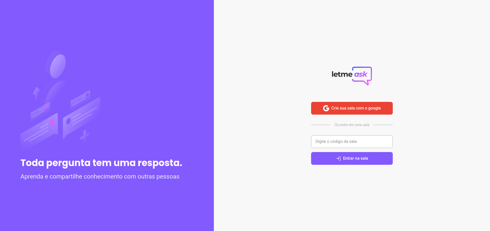

<p align="center">
   
</p>

<br />

<p align="center">
   
   
   
</p>

---

# :pushpin: Table of Contents

- [Features](#rocket-features)
- [Build with](#construction_worker-BuildWith)
- [Installation](#construction_worker-installation)
- [License](#closed_book-license)

# :rocket: Features

- Create rooms.
- Delete, mark as read, highlight questions and end room (Admin only).
- Like questions.
- non marked as highlighted or read questions are organized by the number of likes, highlighted question are grouped first and read questions in the end.
- Enter in a existent room.

## ToDo:

- [ ] Dark mode.
- [ ] Responsive.
- [ ] List public rooms in the home page.
- [ ] Change room state between private and public (Admin only).
- [ ] Room owner can give admin permissions to users.
- [ ] Enter in a public room by the rooms list.
- [ ] Show all users in the current room.

# :construction_worker: BuildWith

- [React.js](https://reactjs.org/)
- [Sass](https://sass-lang.com/)
- [Firebase](https://firebase.google.com/)
- [Typescript](https://www.typescriptlang.org/)

# :construction_worker: Installation

**You need to install [Node.js](https://nodejs.org/en/download/) and [Yarn](https://yarnpkg.com/) (or use npm instead yarn), then in order to clone the project via HTTPS, run this command:**

```
git clone https://github.com/Rafaelb4rros/letmeask.git
```

SSH URLs provide access to a Git repository via SSH, a secure protocol. If you have a SSH key registered in your Github account, clone the project using this command:

```
git clone git@github.com:Rafaelb4rros/letmeask.git
```

**Install dependencies**

```
yarn install
```

**Create a firebase project and put your keys in an .env.local file. <br> Read the [Firebase documentation](https://firebase.google.com/docs/web/setup) for more information.**

**Start development server**

```
yarn start
```

# :closed_book: License

Released in 2022
This project is under the [MIT license](https://github.com/Rafaelb4rros/letmeask/main/LICENSE).

Made with 💜 by [Rafael Barros](https://github.com/Rafaelb4rros) 🚀
